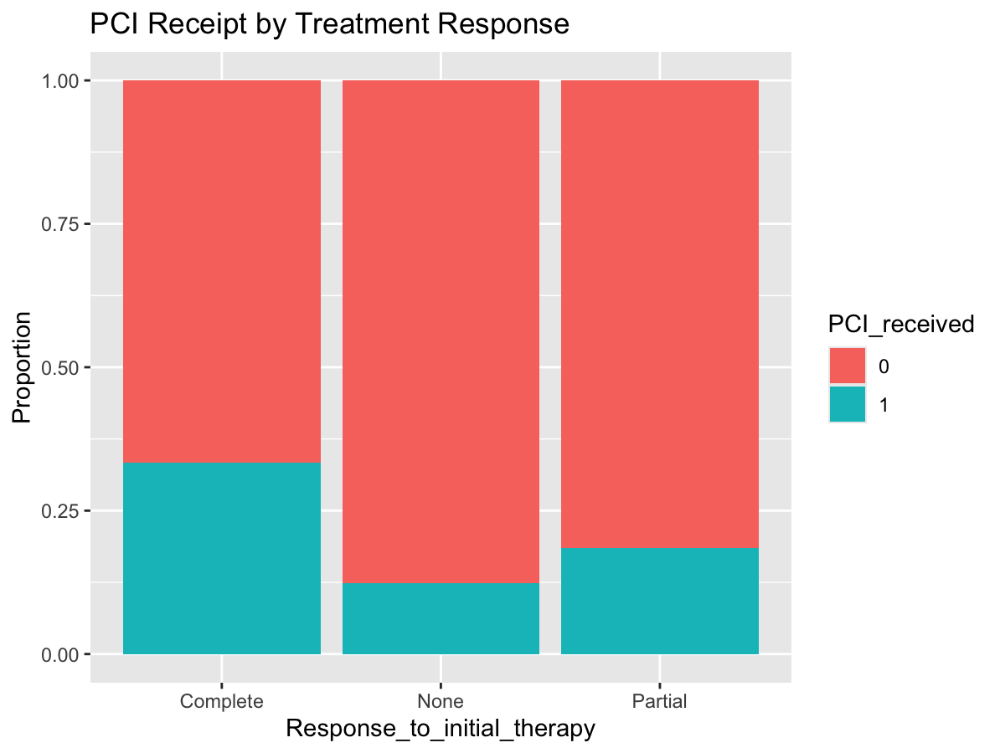

# 🧠 Prophylactic Cranial Irradiation (PCI) in Small Cell Lung Cancer

### A Retrospective Epidemiologic Study Using Simulated Clinical Data

---

## 📌 Overview

This project simulates a **retrospective observational study** evaluating factors associated with receipt of **Prophylactic Cranial Irradiation (PCI)** in patients with Small Cell Lung Cancer (SCLC).

Using a clinically inspired dataset, this analysis explores how patient characteristics and treatment response influence PCI utilization through **logistic regression modeling**.

---

## 🎯 Objectives

* Identify predictors of PCI receipt in SCLC patients
* Estimate associations using **odds ratios (ORs)**
* Demonstrate **confounding and treatment selection bias**
* Build a reproducible **epidemiologic workflow in R**

---

## 📊 Study Design

* **Design:** Retrospective cohort (simulated data)
* **Population:** 300 patients with SCLC
* **Outcome:** PCI receipt (Yes/No)
* **Predictors:**

  * Age
  * Stage (Limited vs Extensive)
  * Response to initial therapy
  * Performance status
  * Comorbidity score

---

## 📁 Project Structure

```
Prophylactic-Cranial-Irradiation-PCI-in-Small-Cell-Lung-Cancer
│
├── data
│   └── sclc_pci_data.csv
│
├── figures
│   └── age_histogram.png
│
├── scripts
│   └── logistic_regression_analysis.R
│
└── README.md
```

---

## 📈 Methods

* Simulated dataset reflecting clinical SCLC characteristics
* Logistic regression model:

```
PCI_received ~ Age + Stage + Response_to_initial_therapy +
               Performance_status + Comorbidity_score
```

* Odds ratios calculated from model coefficients
* Visualization using `ggplot2`

---

## 📊 Results

* Limited-stage disease associated with higher PCI use
* Strong association between treatment response and PCI
* Higher comorbidity and worse performance status reduced PCI likelihood
* Age showed a modest negative association

## 📊 Model Output (Odds Ratios)

| Variable | Odds Ratio |
|---------|-----------|
| Age | 0.96 |
| Limited Stage | 2.8 |
| Complete Response | 4.5 |
| Partial Response | 1.9 |
| Performance Status | 0.55 |
| Comorbidity Score | 0.74 |

*Values are based on simulated data*
---
## 🔑 Key Findings

- Patients with **limited-stage disease** were more likely to receive PCI  
- **Complete response to therapy** strongly increased PCI likelihood  
- Higher **comorbidity burden** reduced PCI use  
- Older patients were slightly less likely to receive PCI  

## 📉 Example Visualization

### Age Distribution by PCI Receipt


### PCI Receipt by Treatment Response


Patients with complete response show a higher proportion of PCI receipt compared to partial or no response groups.
---

## ⚠️ Limitations

* Simulated dataset designed to reflect clinically plausible SCLC characteristics (no real patient data used)”
* No survival outcomes included
* Simplified clinical assumptions

---

## 🛠️ Tools Used

* R
* ggplot2
* dplyr

---

## 👩‍⚕️ Author

**Marianna Wicks, MPH, ODS, CRC**
Precision Medicine | Oncology Data | Biostatistics

---

## ⭐ Key Skills Demonstrated

* Epidemiologic study design
* Logistic regression modeling
* Clinical data simulation
* Data visualization
* Reproducible research workflow
## ▶️ How to Run

1. Clone the repository  
2. Open the project in RStudio  
3. Run the script:

```r
source("scripts/logistic_regression_analysis.R")
